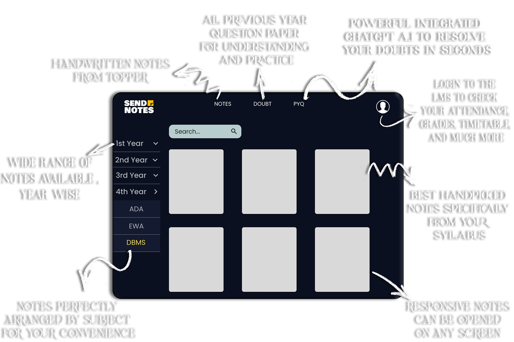
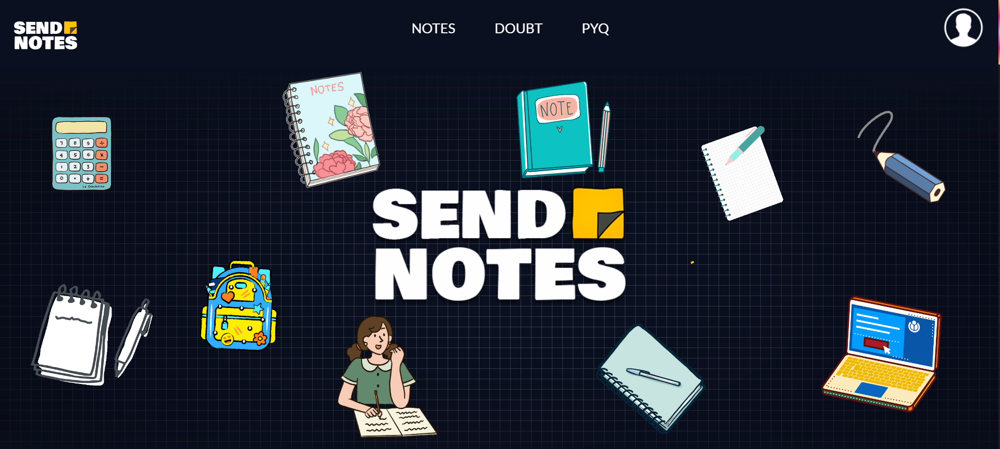
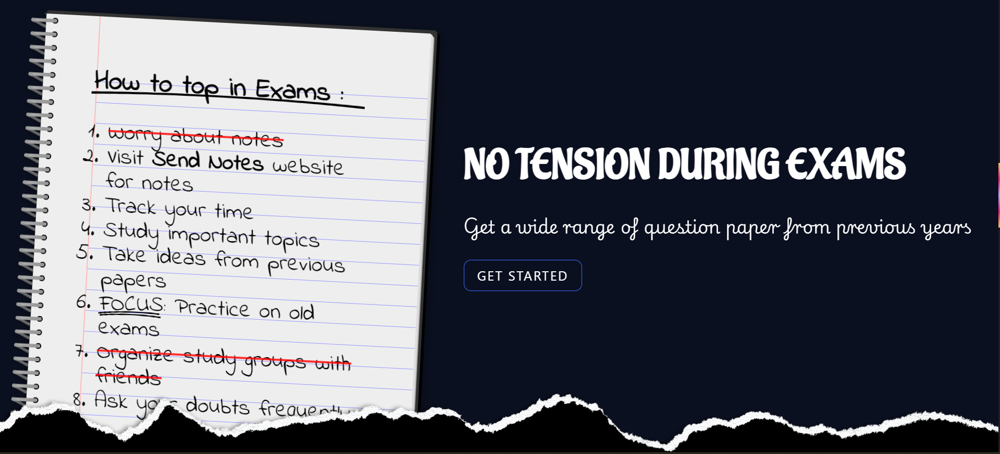
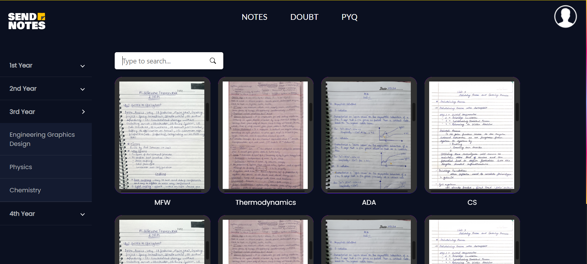
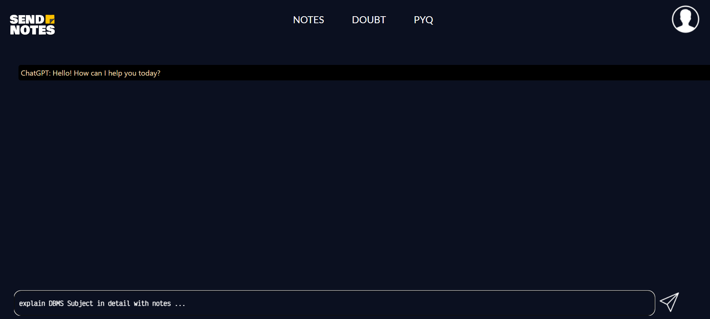

<h1>Send Note</h1>
You can visit this website on : https://send-note.vercel.app/

<h3>This project is designed to revolutionize the way students access and share academic materials.</h3>

 <ul>
        <li><strong>Handwritten Notes from Toppers</strong>: Gain access to the best notes from top performers in your college, meticulously organized for your convenience.</li>
        <li><strong>Tailored Syllabus Notes</strong>: Study what truly matters with handpicked notes specifically tailored to your syllabus.</li>
        <li><strong>Responsive Design</strong>: Enjoy a seamless learning experience with notes accessible on any device—be it a phone, tablet, or computer.</li>
        <li><strong>Extensive Note Collection</strong>: Browse through a comprehensive range of notes, organized by year and subject.</li>
        <li><strong>Detailed Subject-Wise Notes</strong>: Delve deep into detailed notes for each subject, ensuring a thorough understanding of every topic.</li>
        <li><strong>Previous Year Question Papers</strong>: Enhance your preparation with access to all previous year question papers, complete with detailed solutions and expert insights.</li>
        <li><strong>AI-Integrated System</strong>: Resolve your doubts in seconds with our powerful integrated ChatGPT AI, capable of answering complex questions with ease.</li>
        <li><strong>LMS Integration</strong>: Easily check your attendance, grades, timetable, and more by logging into our Learning Management System (LMS).</li>
    </ul>
     

 
<h3>Home Screen :</h3>

 
<h3>Responsive Design :</h3>

 
<h3>Notes :</h3>

 
<h3>Doubts :</h3>

 